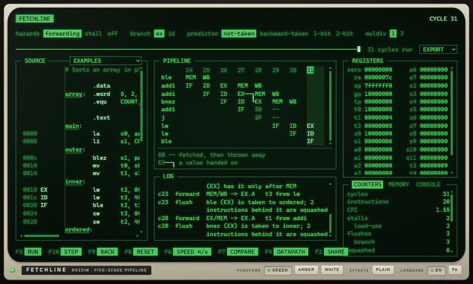
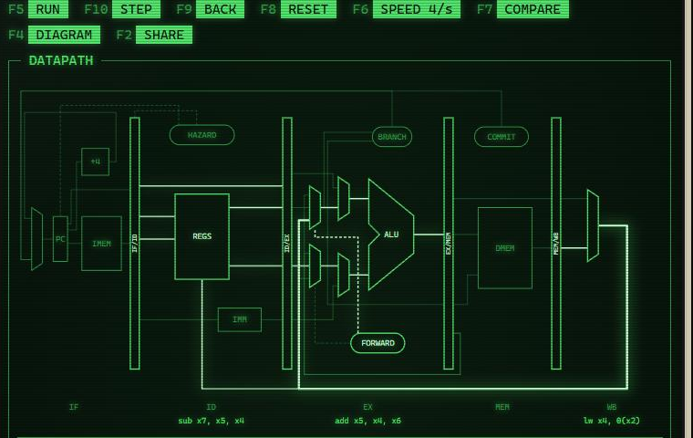
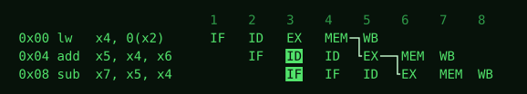
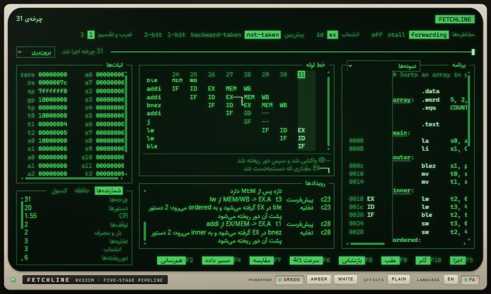

# Fetchline

A RISC-V CPU, an assembler and a pipeline visualizer, written in C#.

Fetchline runs RV32IM programs on a five-stage pipeline and explains what the pipeline does with
them: every stall, flush and forward is an event with a cause, drawn as the textbook diagram and
written as a sentence. The same engine runs in the terminal, in the tests and in the browser.



The engine, the command line and the playground are complete and verified. What each milestone
had to prove is in [docs/SPEC.md](docs/SPEC.md), and how each mechanism works and was checked is
in [docs/CPU.md](docs/CPU.md).

## Build

It needs the .NET 10 SDK and nothing else.

```bash
dotnet build
dotnet test
```

## The playground

The playground is the engine in the browser, on the screen of an old computer: an editor, the
pipeline diagram with its forwards drawn in, the hazard log, registers, memory, the console and
the counters, and a run you can step forwards and backwards.

```bash
dotnet run --project src/Fetchline.Web --launch-profile http
```

Then open <http://localhost:5195>. It is not published anywhere yet. Everything is on the keys
under the screen, which are real function keys too:

| Key | What it does |
|---|---|
| `F5` | Run, and pause |
| `F10`, `F9` | Step one cycle forwards, or back |
| `F8` | Back to reset |
| `F6` | How fast a run goes |
| `F7` | The program on the pipeline built every way, as a table; choosing a row builds it that way |
| `F4` | The datapath in place of the diagram |
| `F2` | A link to what is on screen: the source, the switches and the cycle |

The switches above the diagram build the pipeline another way (forwarding, stalling only or no
hazard handling at all; branches decided in EX or in ID; four predictors; a multiplier of one
cycle or three) and start the run again. The timeline goes to any cycle that has been run, and a
line of the log goes to the cycle it happened in.

`F4` shows the datapath of the pipeline as the switches have built it. The wires in use in the
cycle on screen are the bright ones, and pointing at one says what is on it. Here the `add` in EX
is taking the value the `lw` ahead of it has just read, from MEM/WB, a cycle after the load-use
stall:



The `EXPORT` menu saves the run as far as the cycle on screen: the trace as JSON or as a Kanata
log for [Konata](https://github.com/shioyadan/Konata), the diagram as SVG or PNG. This is the
SVG of the load-use hazard, as it was written:



The `LANGUAGE` switch on the monitor turns the page to Persian. It then runs from the right, and
the diagrams, the code and the dumps stay the way they are read:



The colour of the phosphor is a switch as well, and `PLAIN` turns off the scanlines, the glow
and the flicker.

## The command line

The same run in a terminal:

```bash
dotnet run --project src/Fetchline.Cli -- trace examples/load-use.s
```

```
                          1    2    3    4    5    6    7    8
 0x00 lw   x4, 0(x2)      IF   ID   EX   MEM  WB
 0x04 add  x5, x4, x6          IF   ID   ID   EX   MEM  WB
 0x08 sub  x7, x5, x4               IF   IF   ID   EX   MEM  WB

 c3  stall    load-use: add (ID) needs x4; lw (EX) has it only after MEM
 c5  forward  MEM/WB -> EX.A   x4 from lw
 c6  forward  EX/MEM -> EX.A   x5 from add
 3 instructions, 8 cycles, CPI 2.67, 1 stall, 2 forwards
```

That is the five-stage pipeline: forwarding, the load-use stall, branches decided in EX, and
system instructions and traps taken at the commit point. Underneath it is a reference machine
that runs one instruction at a time and passes the official RISC-V tests (64 of 66; the other
two need features a machine-mode core does not have). The pipeline is checked against it
instruction by instruction.

The pipeline can be built other ways, and each way is a switch: `--hazards forwarding|stall|off`,
`--branch ex|id`, `--predictor not-taken|backward-taken|1-bit|2-bit` with `--btb` entries, and
`--muldiv` cycles for a multiply or a divide. `trace` draws a run with the switches it is given.
`trace --format svg|json|kanata` writes the picture or the whole trace in place of the text, and
`--output` names a file for it.
`compare` runs the program on every combination of the ones it is not given:

```bash
dotnet run --project src/Fetchline.Cli -- compare examples/sum.s --hazards forwarding
```

```
 hazards     branch  predictor       cycles   CPI  stalls  squashed  wrong guesses
 forwarding  ex      not-taken           68  1.70       0        23        9 of 10
 forwarding  ex      backward-taken      52  1.30       0         7        1 of 10
 forwarding  ex      1-bit               54  1.35       0         9        2 of 10
 forwarding  ex      2-bit               54  1.35       0         9        2 of 10
 forwarding  id      not-taken           69  1.73      10        14        9 of 10
 forwarding  id      backward-taken      61  1.53      10         6        1 of 10
 forwarding  id      1-bit               62  1.55      10         7        2 of 10
 forwarding  id      2-bit               62  1.55      10         7        2 of 10

 40 instructions; fewest cycles with the right answer: forwarding, ex, backward-taken (52)
```

Deciding branches a stage earlier is the slower choice for this loop: a wrong guess costs one
cycle instead of two, but every branch waits a cycle for the `addi` just ahead of it. And with
`--hazards off` the pipeline computes the wrong answer on purpose, and says where it first did:

```
 off, ex, not-taken: first wrong value: instruction 4, 'add a0, a0, t0', in cycle 8: the pipeline wrote a0 = 0x00000000, the reference machine wrote a0 = 0x00000001
```

Built any other way it is right, and that is tested rather than hoped: 2,000 random programs
and the official tests run on each of the 64 correct configurations, every run in lockstep with
the reference machine.

```bash
dotnet run --project src/Fetchline.Cli -- run examples/fib.s
```

```
0 1 1 2 3 5 8 13 21 34
```

```bash
dotnet run --project src/Fetchline.Cli -- asm examples/sum.s --listing
```

```
00000000 <main>:
00000000:  00000513  li      a0, 0
00000004:  00100293  li      t0, 1
00000008:  00a00313  li      t1, 10

0000000c <loop>:
0000000c:  00550533  add     a0, a0, t0
00000010:  00128293  addi    t0, t0, 1
00000014:  fe535ce3  bge     t1, t0, loop     # ble t0, t1, loop
...
```

`asm -o program.elf` writes an ELF executable, and `dis` and `run` read one back. A mistake in the
source is reported with its line, a caret, and a suggestion when there is one:

```
prog.s:2:5: error: unknown instruction 'adid'
      adid a0, a0, 1
      ^~~~
  did you mean 'addi'?
```

A program that does something it cannot do is stopped with a sentence, not a wrong answer:

```
fetchline: the program stopped: a store to 0x00000000, which is in 'text' and cannot be written, at pc 0x00000004
  prog.s:3: sw   a0, 0(zero)
```

## Licence

MIT. See [LICENSE](LICENSE).
